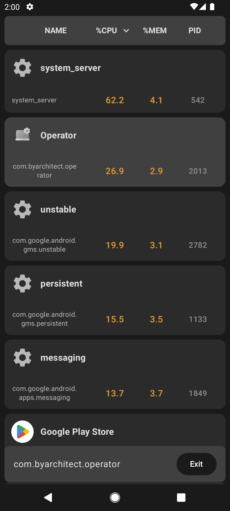
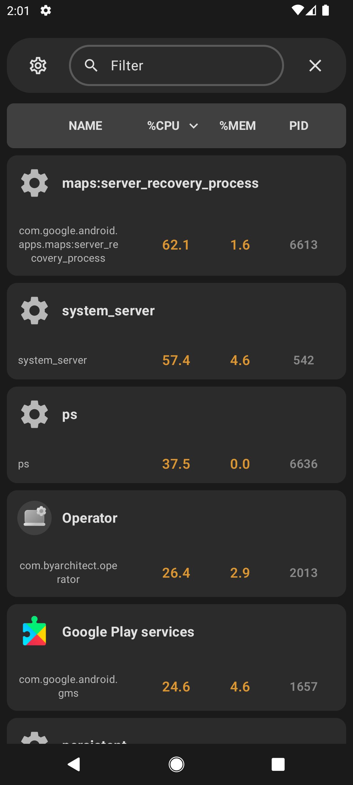

<div align="center">


# Operator

**A root-powered process manager for Android.**
See what's running, what it's costing you, and kill it.

[](https://apt.izzysoft.de/packages/com.byarchitect.operator)
[](https://github.com/by-architect/Operator/releases)
[](#-requirements)
[](Lisence.md)


&nbsp;&nbsp;


</div>

---

## ✨ What it does

Android hides what your device is actually doing. Operator uses root to read the
process table directly, so you get the real picture — and the ability to act on it.

- 📊 **Live process list** — refreshes on your schedule, not the system's
- ⚡ **CPU and memory per process** — find what's draining the battery
- 🔪 **Kill anything** — terminate background processes with root privileges
- 🔎 **Search and sort** — by name, PID, CPU or memory, ascending or descending
- 🧩 **58 selectable columns** — PID, PPID, VSZ, RSS, WCHAN, NI, ARGS and the rest of `ps`
- ⏱️ **Adjustable refresh rate** — trade responsiveness against battery
- 🌑 **Dark, dense, no clutter** — Material 3, built for reading tables

## 📋 Requirements

| | |
|---|---|
| **Android** | 7.0 (API 24) or newer |
| **Root** | Required — Magisk, KernelSU or equivalent |

Operator cannot work without root. It reads the process table through a root
shell ([libsu](https://github.com/topjohnwu/libsu)); there is no non-root mode.

## 📥 Install

[](https://apt.izzysoft.de/packages/com.byarchitect.operator)

Or grab the APK from [Releases](https://github.com/by-architect/Operator/releases).

> [!IMPORTANT]
> **Coming from v1.0.0?** Uninstall it first. v1.0.1 is signed with a new key, so
> Android will refuse it as an update and your settings will be lost.
> [Why](SECURITY.md#signing-key-history).

Verify what you downloaded before installing it:

```bash
apksigner verify --print-certs Operator-v1.0.1.apk
```

The expected fingerprint is in [SECURITY.md](SECURITY.md).

## 🔨 Build

```bash
git clone https://github.com/by-architect/Operator.git
cd Operator
./gradlew assembleRelease
```

Release process and signing are documented in [RELEASING.md](RELEASING.md).

## 🛠️ Built with

Kotlin · Jetpack Compose · Material 3 · Room · libsu

## 📮 Contact

**byarchitect@disroot.org** — security reports, key verification, or anything that
needs a channel other than this repository. See [SECURITY.md](SECURITY.md).

## ⚖️ License

[GNU GPL v3.0](Lisence.md) — free software. Use it, change it, share it.
